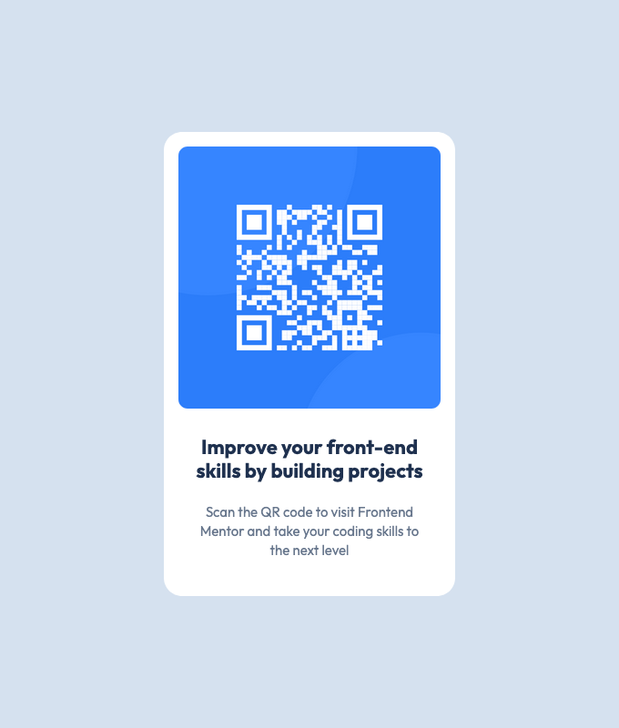

# Frontend Mentor - QR code component solution

This is my solution to the [QR code component challenge on Frontend Mentor](https://www.frontendmentor.io/challenges/qr-code-component-iux_sIO_H). I would appreciate it to get feedback from you.

## Overview

### Screenshot

### Links

- Live Site URL: [Live Preview](https://rfn16zn.github.io/qr-code-component/)

### Built with

- Semantic HTML5 markup
- CSS custom properties
- Flexbox
- (CSS Grid) "I'm going to try building this project again with CSS Grid (template and/or areas) as well"
